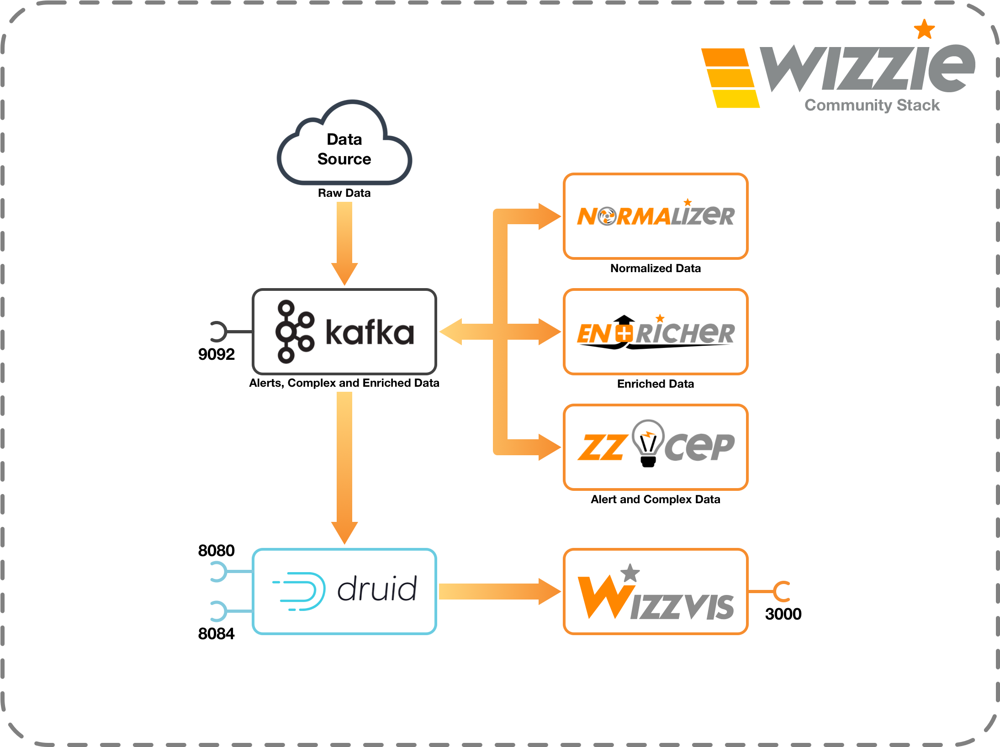

<p align="center">
    
</p>

[](https://github.com/wizzie-io/)

[](https://github.com/wizzie-io/community-stack/releases/latest)
[](http://www.apache.org/licenses/LICENSE-2.0)

Wizzie Community Stack (WCS) is a lightweight version of Wizzie Data Platform ([WDP](https://wizzie.io/)).

## Components and architecture

WCS is composed by:

- **Core**
: Composed by [Kafka](https://kafka.apache.org/), a distributed streaming platform, and [Zookeeper](https://zookeeper.apache.org/), a highly reliable distributed coordinator.

- **Data normalization tool**
: Composed by [Normalizer](https://wizzie-io.github.io/normalizer/), a stream processing engine based on [Kafka Streams](https://docs.confluent.io/current/streams/index.html).

- **Data enrichment tool**
: Composed by [Enricher](https://wizzie-io.github.io/enricher/), a stream enriching engine based on [Kafka Streams](https://docs.confluent.io/current/streams/index.html)

- **Correlation engine**
: Composed by [ZZ-Cep](https://wizzie-io.github.io/zz-cep/), a complex event processing engine based on [Siddhi](https://github.com/wso2/siddhi) and Kafka.

- **Analytic data store**
: Composed by [Druid](https://druid.io/), a high performance analytics data store for event-driven data.

- **Data visualization**
: Composed by [Wizz-Vis](https://github.com/wizzie-io/wizz-vis), an analytics platform for time series metrics using Druid.

Next you can see the WCS architecture:
<p align="center">

<div style="text-align:center"></div>
</p>

You can use our [Prozzie](https://github.com/wizzie-io/prozzie) like *data source*. You can find more information about Prozzie in its [documentation](https://wizzie-io.github.io/prozzie/).

## Requirements

We recommend a machine with at least:

* 4 CPU
* 16 GB RAM
* 30 GB disk

## Installation

In order to install WCS you only need download the latest release or clone the repo and run `setups/linux_setup.sh` script that will guide you through the entire installation.You can also use the next command if you don't want to waste your time messing with git you can run next command as root user or sudo command:

```
sudo bash -c "$(curl -L --header 'Accept: application/vnd.github.v3.raw' 'https://api.github.com/repos/wizzie-io/community-stack/contents/setups/linux_setup.sh?ref=1.0.0')"
```

The setup script will install `Docker` and `Docker Compose` and some necessary tools like `curl` and `net-tools`.

## Up and running WCS

Next you can find information about WCS's configuration, execution and kafka operations.

### Configuration
When you install WCS, the installer will create a `.env` file located in `$PREFIX/etc/wcs` directory, you will configure some vars during installation, but if you need modify some vars you must consider next sections:

* **MANDATORY**: You need to configure this vars before run the application.
* **OPTIONAL**: You can configure this vars, if you want to change some configurations or enable some features.
* **STATIC**: Change this variables is dangerous, you could break some components of WCS! Change it at your own risk

***Note:*** *On some linux distribution you need to open the iptables on the machine, to send data from outside to Kafka broker (port: 9092).*

### Execution

You can use a small tool named `wcs`. It's simply a lightweight CLI to do WCS and Kafka operations.

Now, you only need to run `wcs up -d` to start all components of WCS.

If you can check components, using `wcs compose ps` 

```
root@kubeubuntu:~/community-stack# wcs compose ps
                   Name                                 Command               State               Ports
-------------------------------------------------------------------------------------------------------------------
wizziecommunitystack_druid-broker_1          /bin/sh -c druid-start.sh        Up       0.0.0.0:8080->8080/tcp
wizziecommunitystack_druid-coordinator_1     /bin/sh -c druid-start.sh        Up
wizziecommunitystack_druid-historical_1      /bin/sh -c druid-start.sh        Up
wizziecommunitystack_druid-init_1            /bin/bash -c /bin/bash -c  ...   Exit 0
wizziecommunitystack_druid-middlemanager_1   /bin/sh -c druid-start.sh        Up
wizziecommunitystack_druid-overlord_1        /bin/sh -c druid-start.sh        Up       0.0.0.0:8084->8084/tcp
wizziecommunitystack_enricher_1              /bin/sh -c exec /bin/enric ...   Up
wizziecommunitystack_kafka_1                 start-kafka.sh                   Up       0.0.0.0:9092->9092/tcp
wizziecommunitystack_normalizer_1            /bin/sh -c exec /bin/norma ...   Up
wizziecommunitystack_postgres_1              docker-entrypoint.sh postgres    Up       5432/tcp
wizziecommunitystack_redis_1                 docker-entrypoint.sh redis ...   Up       6379/tcp
wizziecommunitystack_sidekiq_1               scripts/docker-entrypoint- ...   Up
wizziecommunitystack_wizz-vis_1              scripts/docker-entrypoint- ...   Up       0.0.0.0:3000->3000/tcp
wizziecommunitystack_zookeeper_1             /docker-entrypoint.sh zkSe ...   Up       2181/tcp, 2888/tcp, 3888/tcp
wizziecommunitystack_zz-cep_1                /bin/sh -c exec /bin/cep-s ...   Up
```

If you need stop and, later start, WCS you can use `wcs stop` and `wcs start`.

You can use `wcs down` to destroy completly WCS. This operation is dangerous, you will delete database and kafka topics.

### Kafka operations

The `wcs` CLI, provides `kafka` commands in order to **produce**, **consume** and check **topics**. For example:

You can check all available topics running next command:
```
$ wcs kafka topics --list
```

You can consume messages from any kafka's topic using next command:
```
$ wcs kafka consume <topic>
```

You can produce messages to any kafka's topic using next commmand:

```
$ wcs kafka produce <topic>
```

## Uninstall

WCS doesn't provide any mechanism to uninstall `wcs`. If you want to uninstall `wcs` you must do manually.

When you install WCS first time you must specify a `prefix`, by default It's `/usr/local`. In this prefix, WCS creates following directories:

- `${PREFIX}/etc/wcs`
: Contains configuration files.
- `${PREFIX}/share/wcs`
: Contains files about WCS cli and docker compose files.
- `${PREFIX}/bin`
: Contains the symbolic link to `wcs` command.

To uninstall WCS you must follow next steps:

1. Do `wcs down` to stop WCS and delete all databases and kafka topics.
2. Remove `${PREFIX}/share/wcs` and `${PREFIX}/etc/wcs` folders.
3. Remove symbolic link named `wcs` in `${PREFIX}/bin` directory. If `bin` folder It isn't necessary, then you can delete it.

## Ports Binding

You can find ports binding information in next table:

| Service | Port           | Usage                             |
| ------------- | ------------- | -------------------------------- |
| Kafka          | 9092           | Send data to wizzie stack         |
| WizzVis        | 3000           | Access to visualization interface |
| Druid Broker   | 8080           | Query data using druid API        |
| Druid Overlord | 8084           | Manage indexing tasks             |

## Extra documentation

Check next links to know about awesome Wizzie components and check documentation.
* [Normalizer docs](https://wizzie-io.github.io/normalizer/)
* [Enricher docs](https://wizzie-io.github.io/enricher/)
* [ZZ-CEP docs](https://wizzie-io.github.io/zz-cep/)
* WizzVis API docs (Comming soon!)
* [Druid Kafka Indexing tasks docs](http://druid.io/docs/latest/development/extensions-core/kafka-ingestion.html)
* [Druid Querying docs](http://druid.io/docs/latest/querying/querying.html)
* [Kafka Operations docs](https://kafka.apache.org/documentation/#basic_ops)
